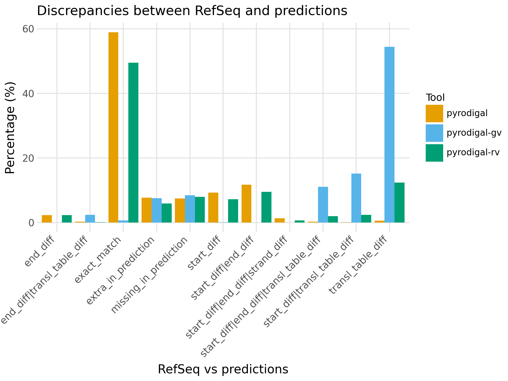
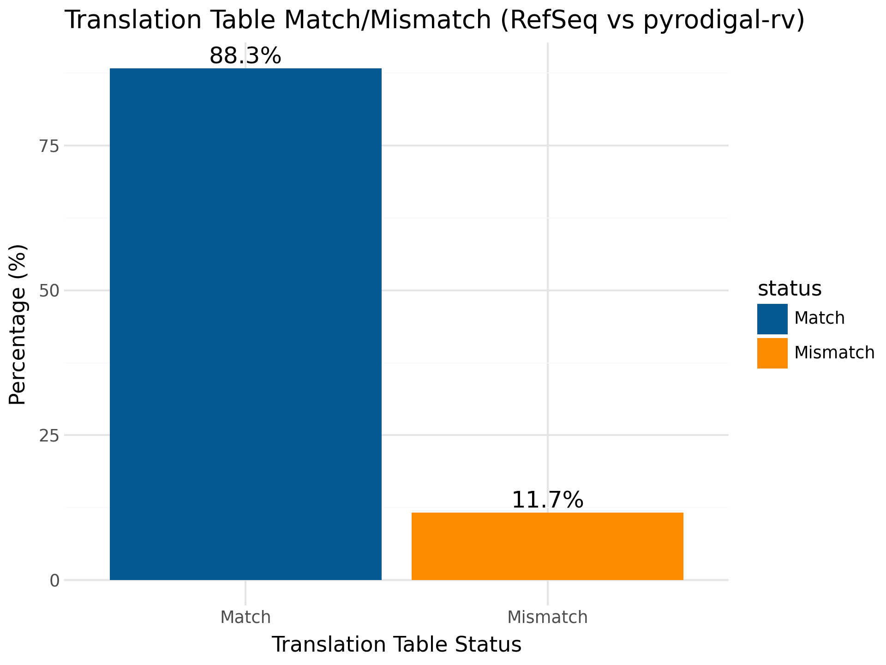
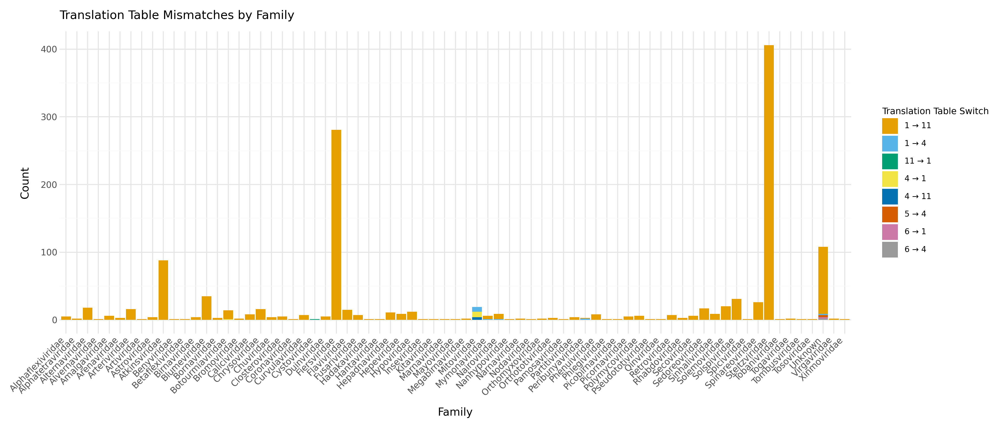

# `pyrodigal-rv` models

This repository contains the notebooks and scripts to reproduce the RNA virus model generation with `pyrodigal`. 

It also contains a notebook to benchmark the performance of [`pyrodigal`](https://github.com/althonos/pyrodigal), [`pyrodigal-gv`](https://github.com/althonos/pyrodigal-gv) and `pyrodigal-rv`.

## 📊 Benchmarking
### Accuracy

To evaluate `pyrodigal-rv` ORF prediction in RNA viruses, all *Riboviria* sequences in RefSeq indicated as "complete" by the sequence submission authors and without N's in the sequence were used as a benchmark (*n=9,001*).

All tools were run in closed mode (`-c`) and `pyrodigal` was forced to use genetic code 1 (`-g 1`) for the benchmarking as this is the most used genetic code by RNA viruses. 
After comparison with the CDS annotations from RefSeq `pyrodigal` and `pyrodigal-rv` give 58.9% and 49.4% exact matches respectively, while both of them also predicted ~25% CDSs with different start and/or stop sites compared to RefSeq. 
For `pyrodigal-rv` another 12.4% was predicted to only have a different translation table.

As expected `pyrodigal-gv` had almost no exact matches because it contains no metagenomic models with genetic code 1, and it also predicts 28.8% CDSs

`pyrodigal-rv` also performed best in context of extra and missing CDS predictions (considerably lower amount extra predictions and only 0.4% more missing predictions compared to `pyrodigal`).

  

`pyrodigal-rv` adds the ability to predict the right genetic code for your RNA virus sequence, when comparing to RefSeq, 11.7% of the sequences had a mismatch in genetic code. 
However, when examining more closely the majority of these sequences belong to the *Atkinsviridae*, *Blumeviridae*, *Fiersviridae*, *Solspiviridae* and *Steitzviridae*, which are RNA phages and should use the bacterial genetic code 11 (as predicted by `pyrodigal-rv`). 
This shows that not all sequences in RefSeq are annotated with the correct translation table and this benchmark underestimated `pyrodigal-rv`'s accuracy in number of exact matches. 

  

  

**Disclaimer:** The training models for `pyrodigal-rv` contain some RefSeq sequences.

### Speed

CLI speed was benchmarked with [hyperfine](https://github.com/sharkdp/hyperfine) over 10 runs of the same command on 9,000 sequences for each CLI ([`pyrodigal`](https://github.com/althonos/pyrodigal), [`pyrodigal-gv`](https://github.com/althonos/pyrodigal-gv) and `pyrodigal-rv`) using 10 processes (`-j 10 --pool process`). 

| Command | Mean [s] | Min [s] | Max [s] | Relative |
|:---|---:|---:|---:|---:|
| `pyrodigal` | 63.883 ± 0.597 | 63.402 | 65.288 | 2.19 ± 0.03 |
| `pyrodigal-gv` | 29.568 ± 0.563 | 28.250 | 30.286 | 1.01 ± 0.02 |
| `pyrodigal-rv` | 29.150 ± 0.199 | 28.860 | 29.540 | 1.00 |